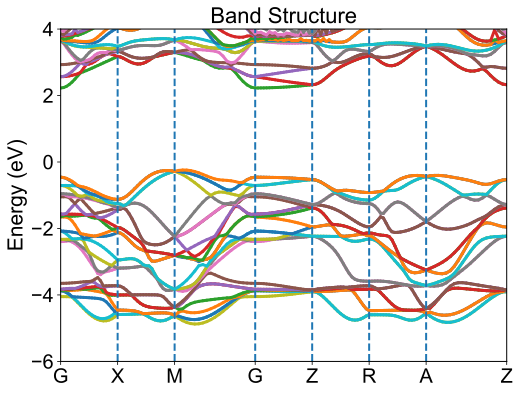

Band Structure Plot
=================================

.. toctree::
   :maxdepth: 2
   :caption: Contents:

For the band structure, one can use :program:`GVasp` to plot it, just run the command:

.. code-block:: bash

    gvasp plot band -j plot.json --save

then, one may obtain the :file:`figure.svg` which plot the band structure.

Just like this,

.. note::
    In the current version, we also incorporate the high-symmetry points in the figure.

For this task, the :file:`plot.json` is like this

.. code-block:: json

    {
        "title": "Band Structure",
        "ylim": [-6, 4],
        "ylabel": "Energy (eV)",
        "bwidth": 2,
        "xlim": [0, 147],
        "xticks": []
    }

The attention of :code:`--show`, :code:`--save` and :code:`--json` can be seen in :ref:`optimization <show_plot>` part.

