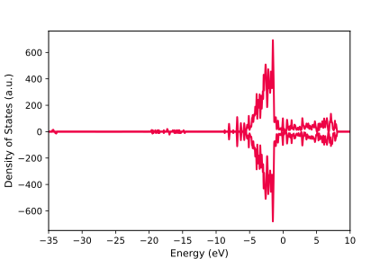
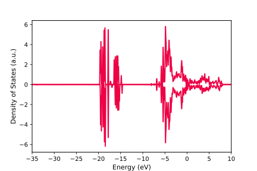
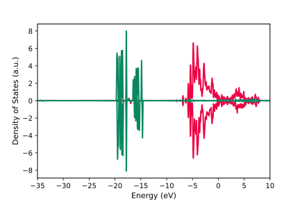

Density of States Plot
=================================

.. toctree::
   :maxdepth: 2
   :caption: Contents:

Density of States (DOS) is vary important to understand the electronic structure of the solid, and our :program:`GVasp` also support its plot.

simple case
------------

Firstly, we start from the Total DOS plot, the files user need to prepare is :file:`DOSCAR` and :file:`CONTCAR`, then run command below:

.. code-block:: bash

    gvasp plot dos -j plot.json --save

The figure is like this:

The plot.json is like this:

.. code-block:: json

    {
      "width":6,
      "height": 4,
      "fontsize": 10,
      "xlim": [-35, 10],
      "dos_file": ["DOSCAR-test"],
      "pos_file": ["CONTCAR-test"],
      "data": {"0": [{"color": "#ed0345"}]}
    }

It can ben seen that, many parameters have been added in plot.json, but actually the :code:`dos_file`, :code:`pos_file` and :code:`data` is required.

* **dos_file**: represents the location of :file:`DOSCAR`, should be a list

* **pos_file**: represents the location of :file:`CONTCAR`, should be a list

* **data**: a dict, key is index of plot DOSCAR/CONTCAR in :code:`dos_file`; value is a list, each element represents a line in the figure

.. note::
    `dos_file` and `pos_file` should have same length

Therefore, for the simple case, we only added the :code:`color` to control the line's color. Very simple, is it?

atoms projection
-----------------

If we want to plot the projection DOS to some atoms, the plot.json is like this:

.. code-block:: json

    {
      "width":6,
      "height": 4,
      "fontsize": 10,
      "xlim": [-35, 10],
      "dos_file": ["DOSCAR-test"],
      "pos_file": ["CONTCAR-test"],
      "data": {"0": [{"atoms":[1, 2, 3, 4, 5], "color": "#ed0345"}]}
    }

The figure is like this:

Actually, because the atoms list is continuous, **syntactic sugar** can be applied, like this

.. code-block:: json

    {
      "width":6,
      "height": 4,
      "fontsize": 10,
      "xlim": [-35, 10],
      "dos_file": ["DOSCAR-test"],
      "pos_file": ["CONTCAR-test"],
      "data": {"0": [{"atoms":"1-5", "color": "#ed0345"}]}
    }

Particularly, if you want to plot all atoms belonging to one element, you can also applied the **syntactic sugar** like this

.. code-block:: json

    {
      "width":6,
      "height": 4,
      "fontsize": 10,
      "xlim": [-35, 10],
      "dos_file": ["DOSCAR-test"],
      "pos_file": ["CONTCAR-test"],
      "data": {"0": [{"atoms":"O", "color": "#ed0345"}]}
    }

If you want to decomposing to orbitals, add the :code:`orbitals` parameter, like this:

.. code-block:: json

    {
      "width":6,
      "height": 4,
      "fontsize": 10,
      "xlim": [-35, 10],
      "dos_file": ["DOSCAR-test"],
      "pos_file": ["CONTCAR-test"],
      "data": {"0": [{"atoms":"O", "orbitals": ["p"], "color": "#ed0345"}]}
    }

multiple lines
---------------

One figure, one DOSCAR, multiple lines, modify the plot.json like this:

.. code-block:: json

    {
      "width":6,
      "height": 4,
      "fontsize": 10,
      "xlim": [-35, 10],
      "dos_file": ["DOSCAR-test"],
      "pos_file": ["CONTCAR-test"],
      "data": {"0": [{"atoms":"O", "orbitals": ["p"], "color": "#ed0345"},
                     {"atoms":"O", "orbitals": ["s"], "color": "#098760"}]}
    }

The figure is like this:

multiple files
---------------

Not enough, if you want to compare different structures, you can modify the plot.json like this

.. code-block:: json

    {
      "width":6,
      "height": 4,
      "fontsize": 10,
      "xlim": [-35, 10],
      "dos_file": ["DOSCAR-test", "DOSCAR-test2"],
      "pos_file": ["CONTCAR-test", "CONTCAR-test2"],
      "data": {"0": [{"atoms":"O", "orbitals": ["p"], "color": "#ed0345"}],
               "1": [{"atoms":"O", "orbitals": ["p"], "color": "#098760"}]}
    }

It's still very simple, what you need to do is modify the plot.json, run the command again, then you got it ~~