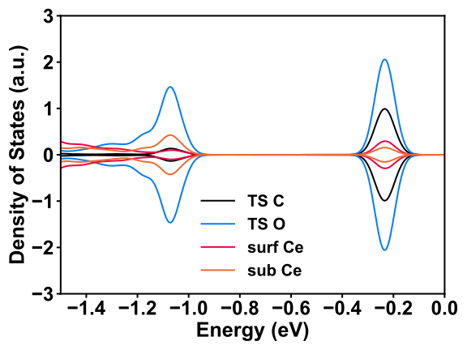

.. _dos_plot:

Density of States Plot
========================

.. toctree::
   :maxdepth: 2
   :caption: Contents:

Density of States (DOS) is vary important to understand the electronic structure of the solid, and our :program:`GVasp` also support its plot.

simple case
------------

Firstly, we start from the Total DOS plot, the files user need to prepare is :file:`DOSCAR` and :file:`CONTCAR`, then run command below:

.. code-block:: bash

    gvasp plot dos -j plot.json --save

The figure is like this:

.. image:: dos1.svg
   :align: center

The plot.json is like this:

.. code-block:: json

    {
      "width":6,
      "height": 4,
      "fontsize": 10,
      "xlim": [-35, 10],
      "dos_file": ["DOSCAR-test"],
      "pos_file": ["CONTCAR-test"],
      "data": {"0": [{"color": "#ed0345"}]}
    }

It can ben seen that, many parameters have been added in plot.json, but actually the :code:`dos_file`, :code:`pos_file` and :code:`data` is required.

* **dos_file**: represents the location of :file:`DOSCAR`, should be a list

* **pos_file**: represents the location of :file:`CONTCAR`, should be a list

* **data**: a dict, key is index of plot DOSCAR/CONTCAR in :code:`dos_file`; value is a list, each element represents a line in the figure

.. note::
    `dos_file` and `pos_file` should have same length

Therefore, for the simple case, we only added the :code:`color` to control the line's color. Very simple, is it?

atoms projection
-----------------

If we want to plot the projection DOS to some atoms, the plot.json is like this:

.. code-block:: json

    {
      "width":6,
      "height": 4,
      "fontsize": 10,
      "xlim": [-35, 10],
      "dos_file": ["DOSCAR-test"],
      "pos_file": ["CONTCAR-test"],
      "data": {"0": [{"atoms":[1, 2, 3, 4, 5], "color": "#ed0345"}]}
    }

The figure is like this:

.. image:: dos2.svg
   :align: center

Actually, because the atoms list is continuous, **syntactic sugar** can be applied, like this

.. code-block:: json

    {
      "width":6,
      "height": 4,
      "fontsize": 10,
      "xlim": [-35, 10],
      "dos_file": ["DOSCAR-test"],
      "pos_file": ["CONTCAR-test"],
      "data": {"0": [{"atoms":"1-5", "color": "#ed0345"}]}
    }

Particularly, if you want to plot all atoms belonging to one element, you can also applied the **syntactic sugar** like this

.. code-block:: json

    {
      "width":6,
      "height": 4,
      "fontsize": 10,
      "xlim": [-35, 10],
      "dos_file": ["DOSCAR-test"],
      "pos_file": ["CONTCAR-test"],
      "data": {"0": [{"atoms":"O", "color": "#ed0345"}]}
    }

Multi-Elements is now also supported, like this:

.. code-block:: json

    {
      "width":6,
      "height": 4,
      "fontsize": 10,
      "xlim": [-35, 10],
      "dos_file": ["DOSCAR-test"],
      "pos_file": ["CONTCAR-test"],
      "data": {"0": [{"atoms":["O", "Ce"], "color": "#ed0345"}]}
    }

If you want to decomposing to orbitals, add the :code:`orbitals` parameter, like this:

.. code-block:: json

    {
      "width":6,
      "height": 4,
      "fontsize": 10,
      "xlim": [-35, 10],
      "dos_file": ["DOSCAR-test"],
      "pos_file": ["CONTCAR-test"],
      "data": {"0": [{"atoms":"O", "orbitals": ["p"], "color": "#ed0345"}]}
    }

multiple lines
---------------

One figure, one DOSCAR, multiple lines, modify the plot.json like this:

.. code-block:: json

    {
      "width":6,
      "height": 4,
      "fontsize": 10,
      "xlim": [-35, 10],
      "dos_file": ["DOSCAR-test"],
      "pos_file": ["CONTCAR-test"],
      "data": {"0": [{"atoms":"O", "orbitals": ["p"], "color": "#ed0345"},
                     {"atoms":"O", "orbitals": ["s"], "color": "#098760"}]}
    }

The figure is like this:

.. image:: dos3.svg
   :align: center

use fill method
----------------

You can also plot the dos in fill format, and the alpha argument is also accepted.

.. code-block:: json

    {
      "width":6,
      "height": 4,
      "fontsize": 10,
      "xlim": [-0.5, 0],
      "dos_file": ["DOSCAR_dos"],
      "pos_file": ["CONTCAR_dos"],
      "data": {
        "0": [{"atoms":["C"],"color": "b", "orbitals":["s", "p"],"method": "fill", "alpha": 0.3},
              {"atoms":["H"],"color": "g", "orbitals":["s", "p"],"method": "fill", "alpha": 0.3}]}
    }

The figure is like this:

.. image:: dos4.svg
   :align: center

specify legends
----------------

You can specify the legends like this:

.. code-block:: json

    {
      "width": 8,
      "height": 6,
      "bwidth": 2,
      "weight": "bold",
      "fontsize": 22,
      "xlim": [-1.5, 0],
      "ylim": [-3, 3],
      "dos_file": ["DOSCAR_clean_TS2"],
      "pos_file": ["CONTCAR_clean_TS2"],
      "data": {
        "0": [{"atoms":["C"],"color": "#000000","method": "line","label": "TS C"},
              {"atoms":[68],"color": "#047df6","method": "line","label": "TS O"},
              {"atoms":[23],"color": "#ed0345","method": "line","label": "surf Ce"},
              {"atoms":[22],"color": "#ef6932","method": "line","label": "sub Ce"}]}
    }

The figure is like this:

multiple files
---------------

Not enough, if you want to compare different structures, you can modify the plot.json like this

.. code-block:: json

    {
      "width":6,
      "height": 4,
      "fontsize": 10,
      "xlim": [-35, 10],
      "dos_file": ["DOSCAR-test", "DOSCAR-test2"],
      "pos_file": ["CONTCAR-test", "CONTCAR-test2"],
      "data": {"0": [{"atoms":"O", "orbitals": ["p"], "color": "#ed0345"}],
               "1": [{"atoms":"O", "orbitals": ["p"], "color": "#098760"}]}
    }

DOS align
----------

In some cases, if you want to compare two or more DOS, aligning the energy levels is important to understand the difference between two systems. Usually, we select the innermost orbital of one bulk atom, e.g., bulk O atom, 2s orbital, as the reference energy level to align two or more systems. Now, GVasp can automatically perform such process and the plot.json should include the :code:`align` items, like this

.. code-block:: json

    {
      "width":6,
      "height": 4,
      "fontsize": 10,
      "xlim": [-35, 10],
      "dos_file": ["DOSCAR-test", "DOSCAR-test2"],
      "pos_file": ["CONTCAR-test", "CONTCAR-test2"],
      "align": [(78, "s"), (81, "s")],
      "data": {"0": [{"atoms":"O", "orbitals": ["p"], "color": "#ed0345"}],
               "1": [{"atoms":"O", "orbitals": ["p"], "color": "#098760"}]}
    }

It's still very simple, what you need to do is modify the plot.json, run the command again, then you got it ~~

.. important::
    The default DOSCAR format is regulated by setting the LORBIT=12 in INCAR, so if your LORBIT in INCAR is not 11 or 12, please add `"LORBIT": 10` in the plot.json.
