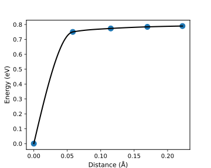

NEB images Plot
=================================

.. toctree::
   :maxdepth: 2
   :caption: Contents:

For the transition state using the NEB method, one can use :program:`GVasp` to plot the energy difference of all images, just run the command:

.. code-block:: bash

    gvasp plot neb -j plot.json --save

then, one may obtain the :file:`figure.svg` like this

For this task, the :file:`plot.json` is like this

.. code-block:: json

    {
        "width": 5,
        "height": 4,
        "fontsize": 10,
    }

The attention of :code:`--show`, :code:`--save` and :code:`--json` can be seen in :ref:`optimization <show_plot>` part.
