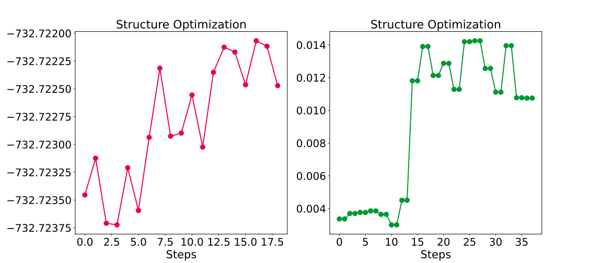

Optimization trajectory Plot
=================================

.. toctree::
   :maxdepth: 2
   :caption: Contents:

For the optimization, one may not only care about the structural evolution (which can be visualized :ref:`here <opt_movie>`), but also the **energy/force** change with the **optimization steps**, which can also be analyzed by :program:`GVasp`.

A simple code need to be typed for this work:

.. code-block:: bash

    gvasp plot opt -j plot.json --save

then, one may obtain the :file:`figure.svg` which plot the energy and force change with the steps increment.

Just like this,

The only parameter in plot.json is :code:`height`, certainly it is optional.

.. code-block:: json

    {
        "height":7
    }

.. _show_plot:

.. attention::
    The **json file** is required, even if is empty, :command:`touch` it.

.. note::
    **-\-show** or **-\-save** should specify one, and only need to one, otherwise nothing happen.

