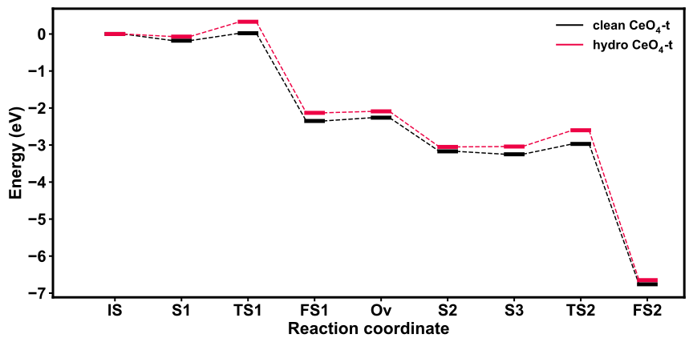

Potential Energy Surface Plot
=================================

.. toctree::
   :maxdepth: 2
   :caption: Contents:

Potential Energy Surface (PES) plot is important in reaction mechanism research, and our :program:`GVasp` certainly support to plot PES with *various* data.

simple case
------------

A very simple reaction data like this (noted they are all relative energy):

.. code-block:: python

    data = [0, -0.09, 0.75, 0.06, 0.26, -2.46, -1.02, -1.58]

We can plot it by run the command like before:

.. code-block:: bash

    gvasp plot PES -j plot.json --save

And the figure like this:

.. image:: pes1.svg
   :align: center

The plot.json is like this:

.. code-block:: json

    {
     "data": [[0, -0.09, 0.75, 0.06, 0.26, -2.46, -1.02, -1.58]]
    }

.. note::
    **data** parament is a set of lines, so even if you have only one line, its type should be List[List[float]].

change style
-------------

By add a :code:`style="solid_curve"`, the figure can be changed like this:

.. code-block:: json

    {
      "data": [[[0, -0.09, 0.75, 0.06, 0.26, -2.46, -1.02, -1.58],["MS", "MS", "TS", "MS", "TS", "MS", "TS", "MS"]]],
      "style": "solid_curve"
    }

.. attention::
    For the "solid_curve" style, one need to specify the data belonging to a intermediate state (MS) of transition state (TS), so **data** parament' type now be List[List[List[float], List[str]]].

None value
-----------

If your data have :code:`None`, the :program:`GVasp` can work well.

for example,

.. code-block:: python

    data = [0, None, None, 0.06, None, None, 0.39, -1.51]

The plot figure is like this:

The plot.json is like this:

.. code-block:: json

    {
      "data": [[0, null, null, 0.06, null, null, 0.39, -1.51]]
    }

.. important::
    **Json** file can't recognize the None value, so we substitute the *None* as *null*.

multiple lines
---------------

If you want to compete different reaction pathway, data like below:

.. code-block:: python

    data = [[0, -0.09, 0.75, 0.06, 0.26, -2.46, -1.02, -1.58],
            [None, None, None, None, None, -2.46, -0.95, -1.66],
            [None, None, None, 0.06, None, None, 0.39, -1.51]]

The plot figure is like this:

The plot.json is like this:

.. code-block:: json

    {
        "data" : [[0, -0.09, 0.75, 0.06, 0.26, -2.46, -1.02, -1.58],
                  [null, null, null, null, null, -2.46, -0.95, -1.66],
                  [null, null, null, 0.06, null, null, 0.39, -1.51]],
        "text_type": null
    }

And we close the `text` by add :code:`text_type = null`.

specify legends
-----------------

If you want to add the legends for different reaction pathways, data like below:

.. code-block:: python

    data = [[0, -0.18, 0.02, -2.35, -2.26, -3.17, -3.25, -2.97, -6.76],
            [0, -0.07, 0.33, -2.13, -2.09, -3.05, -3.04, -2.60, -6.65]]

The plot figure is like this:

The plot.json is like this:

.. code-block:: json

    {
        "data" : [[0, -0.18, 0.02, -2.35, -2.26, -3.17, -3.25, -2.97, -6.76],
                  [0, -0.07, 0.33, -2.13, -2.09, -3.05, -3.04, -2.60, -6.65]],
        "text_type": null,
        "legends": [[0,0,"clean $CeO_4$-t"],
                    [0,0,"hydro $CeO_4$-t"]]
    }

Where the legends are described by a tri-tuple (x_position, y_position, label).

Here, you may known how to plot the PES with :program:`GVasp`, of course, it can do better in the future.
