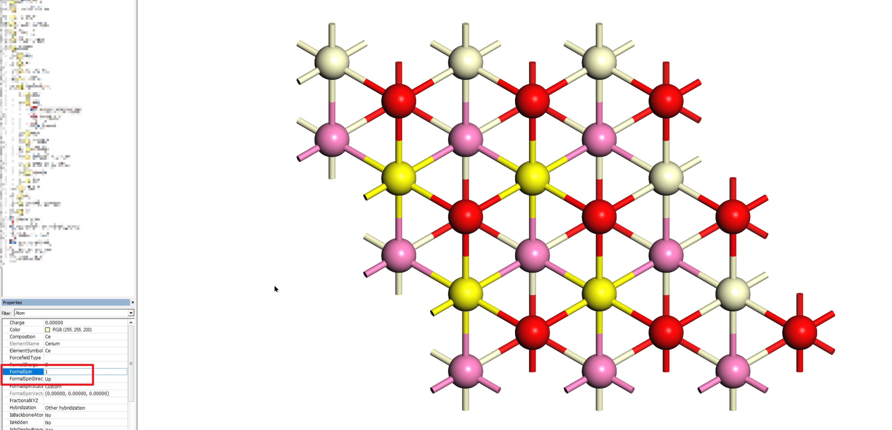

.. |inputs| replace:: :file:`INCAR`, :file:`KPOINTS`, :file:`POSCAR` and :file:`POTCAR`

.. _generate:

Generate VASP Inputs
=================================

:program:`GVasp` can help user quick generate VASP inputs (|inputs|), just need to prepare a `*.xsd` file and run :file:`gvasp submit TASK [arguments]`.

The following arguments can be applied in all of the tasks, while other arguments will describe in corresponding sub-topic.

.. list-table::
    :widths: 15 30
    :header-rows: 1

    * - Argument
      - Description
    * - -P/-\-potential
      - specify the potential
    * - -V/-\-vdw
      - open the vdw-correction
    * - -S/-\-sol
      - including the solvation effect
    * - -G/-\-gamma
      - perform the Gamma-point calculation
    * - -N/-\-nelect
      - perform charged system calculation

Detailed information about the mentioned arguments can see in :ref:`opt <optimization>` task.

If one want to apply the magnetic calculations, the `*.xsd` file prepared by the following steps is needed (e.g., CeO\ :sub:`2`\ -111-model).

1. Select atoms you want to specify the initial `MAGMOM`;

2. Modify the FormalSpin equal to the `MAGMOM`;

.. note::
    In the current version, the `*.xsd` file can't perform makeP1 operation first.

.. toctree::
   :maxdepth: 1
   :caption: Contents:

   submit/opt
   submit/chg
   submit/wf
   submit/dos
   submit/freq
   submit/md
   submit/stm
   submit/ts
